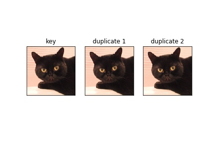
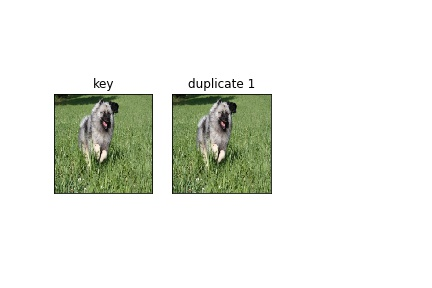
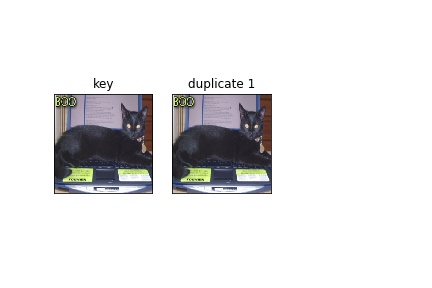

# Finding Duplicate Images

In this notebook task of finding all the different duplicate images among the given set of image is performed. Huge database of images exists which have multiple copies of same image with different ids/ names. To remove duplicate images from such database an efficient way, then comparing similarity of each image with every other image to find the duplicates, is required.

For the purpose of finding the duplicates, in this notebook, images are first passed through a feature extractor (deep learning network trained on a classification task with last classification layer removed). The feature vector or image vector found are then coverted to hash codes for efficent search using [Locality Sensitivity Hashing (LSH)](https://en.wikipedia.org/wiki/Locality-sensitive_hashing).

[annoyindex](https://github.com/spotify/annoy) package is used to perform LSH. The hash code of an image is found by making multiple random hyperplanes on the dimension of image vector and hash code is given by the sides of each hyperplane a particular image lies. This works on the intuition that on high dimensional space similar objects will have similar location on the space.

Once the hash for all the images are found a particular image is tested for similarity only with images having same hash code. This allows the search for duplicate to be done much quicker.

## Packages used

keras, tensorlfow, numpy, cv2, matplotlib, annoyindex

## Dataset

For this notebook any image dataset containing duplicate images would suffice, although a dataset which already have all the duplicates found will allow for model comparison.

The link for the dataset used in this notebook is [here](http://www.robots.ox.ac.uk/~vgg/data/pets/?source=post_page---------------------------). Only the images are requried for this notebook.

## Results 

Here are few examples of the dupicate images found:

