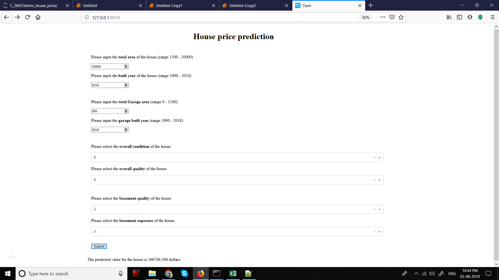

# House Price Prediction with Dash Demo

This is an example script for using dash to create a web app to predict the price of house. This can be used to demo a simple machine learning program to someone who have no idea of how machine learning produces different results for different inputs.

A simple [XGB](https://xgboost.readthedocs.io/en/latest/index.html) based regressor is trained for producing the results. Since the model was made for the purpose of demo, only the top 20 most important features were used to train the model. This showed more deviation in the predicted value of the house while changing a single input value, which is ideal for purpose of demo.

For the pusrpose of producing the demo, [Dash](https://plot.ly/dash) was used to create the webapp. The webapp allowed the user to change few categorical and few continous features. The valid range for continous features are mentioned and upon a button click, result is produced for the input values.

## Packages used

sklearn, xgb, numpy, pandas, dash, scipy

## Dataset

For this notebook the dataset was taken from this [kaggle competetion](https://www.kaggle.com/c/home-data-for-ml-course). The dataset was filled for missing values, with appropriate assumptions. Since the purpose of this work is demo, any dataset with continous/categorical features can be used.

## Usage

Download the [demo script](./web_home_price.py) from this folder and also unzip the data in the same folder, such that the downloaded script and the folder home-data-for-ml-course lies at same location. From a cmd prompt navigate to this location and run the python script.

If succesful, for default dash settings it will ask you to open the link -> http://127.0.0.1:8050/ . On navigating to the link a web app like shown below should open up for user interaction.

