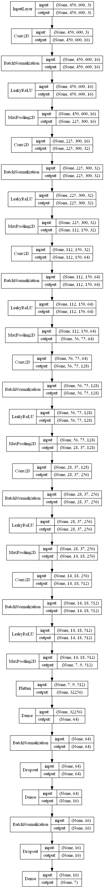

# Image Classifier

Image classification is a task of classifying images into two or more classes. A simple yet powerful neural network models are built to classify the images.

Two different models are compared here with the only difference of snapshot training being used in 2nd classifier model:
 1. [skin_cancer_classification_1](./skin_cancer_classification_1.ipynb) 
 2. [skin_cancer_classification_2](./skin_cancer_classification_2.ipynb) 

## Packages used

keras, sklearn, tensorlfow, numpy, pandas, cv2, matplotlib

## Dataset

For performing the task of Image Classification a medical dataset, in which we need to classify the type of skin disease shown in a given image, is used.

[Here](https://www.kaggle.com/kmader/skin-cancer-mnist-ham10000/kernels) is the link to the dataset.

## Model Architecture

A Convolution based model is used here to classify the images.

There are 6 convolution layers with kernel size of (1,1) and number of kernels increases from 16 to 512.

Each Convolution layer is followed by batch normaliztion layer and Leaky ReLU activation.

Max pooling of features after each convolution block is performed to reduce the size of features by 2.

Finally dense layers are used to classify the features found from the convolution layer.

Categorical Cross entropy is used as the loss function and adam is the optimizer.

## Comparison 

Here are the training curves for both the classifiers.
 
   

Orange curve is for the model without cyclic learning rate. The blue curve representing the model with cosine annealed learning rate, deviates from the local minima during the start of each cycle (when learning rate is increased to initial, maximum value). 

