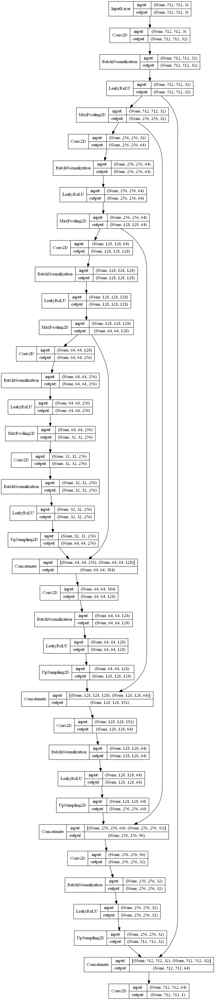

# Image Segmentation

Image segmentaion or Pixel wise segmentation is a task in which each pixel in the image are classified into 2 or more classes.
In this notebook we need to classify pixels of image into just 2 classes and hence the output needed for this task is a black white mask of the object of interest.

Here 3 different models are compared:
  1.  [lungs_conv_unet](./lungs_conv_unet.ipynb) - An autoencoder model with U-Net architecture is used.
  2.  [lungs_incp_unet](./lungs_incp_unet.ipynb) - Model same as above except the convolution layers replaced with inception blocks.
  3.  [lungs_incp_unet_snapshot](./lungs_incp_unet_snapshot.ipynb) - Model exactly same as the lungs_incp_unet model with the addition of cosine annealed Learning rate. 

## Packages used

keras, sklearn, tensorlfow, numpy, pandas, cv2, matplotlib

## Dataset

For showing comparison study in the task of Image Segmentation, a dataset where we need to segment lesions from the CT scans of lungs. 

There are total 267 CT scans of lungs corresponding with the manually labelled segmented masks.

  

[Here](https://www.kaggle.com/kmader/finding-lungs-in-ct-data/home) is the link to the dataset.

## Model Architecture

A Convolution based Auto Encoder model is used here to classify the images.

In the encoder there are 4 Convolution layers, with increasing number of kernels in each layer. 

Each Convolution layer is followed by batch normaliztion layer and Leaky ReLU activation and the size of features is reduced by a factor of 2 by max pooling feature from each kernel.

In the decoder it has 4 convolution layers of same feature sizes as the encoder layers, but with double the number of kernels. The upsampled feature and the corresponding features from the encoder layer are stacked.

The last layer  gives an image of same size with each pixel either as 0 or 1.

In the models using inception blocks each block of convolution- batch normaliztion - Leaky Relu is replaced with an inception block.

## Comparison 

As found, the model with Convolution layers have an IOU of **0.0**, compared to model with inception block where IOU is **0.43**.

The best performing model was the [third model](./lungs_incp_unet_snapshot.ipynb) which uses Inception blocks along with cosine anneal learning rate and the IOU here is **0.977**.

