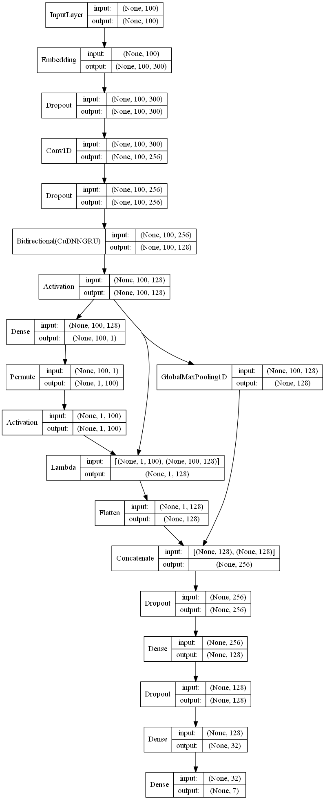

# Intent Classifier

Intent classification is a step in NLU, where we need to understand what does the user want, by processing the user query. A small document is written [here](./Intent_Classifier.md) to understand about Intent Classification and how it can be used to make a simple chatbot.

[Here](./intentclassifier.ipynb) an example notebook is given to perform intent classification of an incoming user query.

## Packages used

keras, sklearn, tensorlfow, numpy, pandas, json
## Dataset

For performing the task of Intent Classification, dataset was taken from [here]( https://github.com/snipsco/nlu-benchmark/tree/master/2017-06-custom-intent-engines). This Dataset have been collected from different sources and have queries pertaining to 7 different intents - addtoplaylist, bookrestaurant, getweather, playmusic, ratebook, searchcreativework and searchscreeningevent. 

## Model Architecture

Using a preloaded glove vectors as embedding weights for the model.

Embedded word vectors are first passed to 1D convolution and than to bidirectional GRU. GRU takes care of the sequential information, while CNN improves the embeddings by emphasizing on neighbor information.

Global max pool layer is used to pool 1 feature from each of the feature vector.

Features are enriched with concatenating Self-attended features of the RNN output.

Finally multiple fully-connected layers are used to classify the incoming query into one of the possible intents.

Adam optimizer and sparse categorical crossentropy loss are used.

