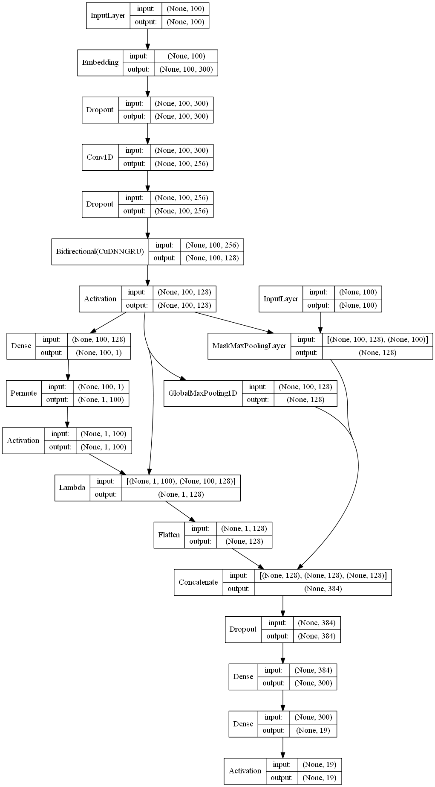

# Semantic Relation Extraction

This is an example of performing Semantic relation extraction in Python using Keras with tensorflow backend.

In this notebook, relation between two words in sentence is to be found. A simple example of relation can be 'cause of'. An entity 'A' can be cause of entity 'B'. 

Relation extraction is a part of Natural Language Understanding and can be used to extract useful features from the text corpus. It is used to understand the relations among entities in a sentence. 

## Packages used 

keras, sklearn, tensorlfow, numpy, regex, pickle, nltk

## Dataset

For performing the task of semantic relation extraction, dataset for SemEval-2010 task 8, was used. The dataset contains sentences, with both the entities marked and the corresponding relation for them.

More about the dataset can be found [here](http://www.aclweb.org/anthology/S10-1006).

## Model Architecture

Using preloaded glove vectors as embedding weights for the model.

Embedded word vectors are first passed to 1D convolution and than passed to bidirectional GRU. GRU takes care of the sequential information, while CNN improves the embeddings by emphasizing on neighbor information.

Global max pooled, mask max pooled and Self-attended features of the RNN output are all concatenated and passed to the dense layers.

Finally multiple fully-connected layers are used to classify the incoming query into one of the possible intents.

Adam optimizer and sparse categorical crossentropy loss are used.

