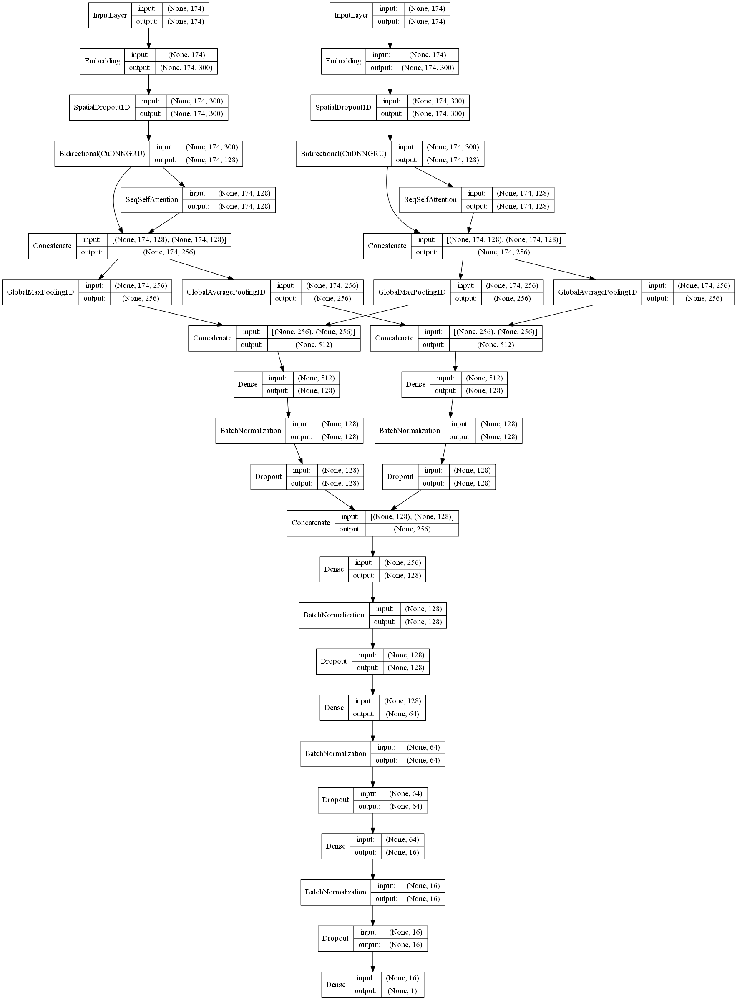

# Text Classification

Here text classification is performed using various neural layers in Python using Keras with tensorflow backend.

In this notebook, we need to classify user comments into positive(1) or negative(0) sentiments. To perform well on the task the model must understand the sentiments in the user query. For this different models having various different parameters and layers have been experimented and compared with.

2 different python notebooks are present:

1. The [comparison notebook](classification_imdb.ipynb) compares lots of different models by selecting the layers (choice among GRU/ LSTM), whether to use Self-attention, Multihead-attention, use of global average pooling layer and choice among the word embedding files to use.

2. The [second notebook](self_Attn_on_seperate_fets_of_2embds.ipynb) have the best result on the test dataset for my testings. These model uses Glove and FastText embeddings as seperate features in upper layers, and the features extracted from these embeedings using SpatialDropout, GRU, Sequence self-attention and Global pooling layers are concatenated and passed to dense layers for classification.

## Packages used 

keras, sklearn, tensorlfow, numpy, keras_self_attention, keras_multi_head

## Dataset

For performing the task of Text Classification, IMDB sentiment analysis dataset was used. This is a popular dataset for text classification in customer reviews of the movies. 

The dataset can be found [here](http://ai.stanford.edu/~amaas/data/sentiment/).

